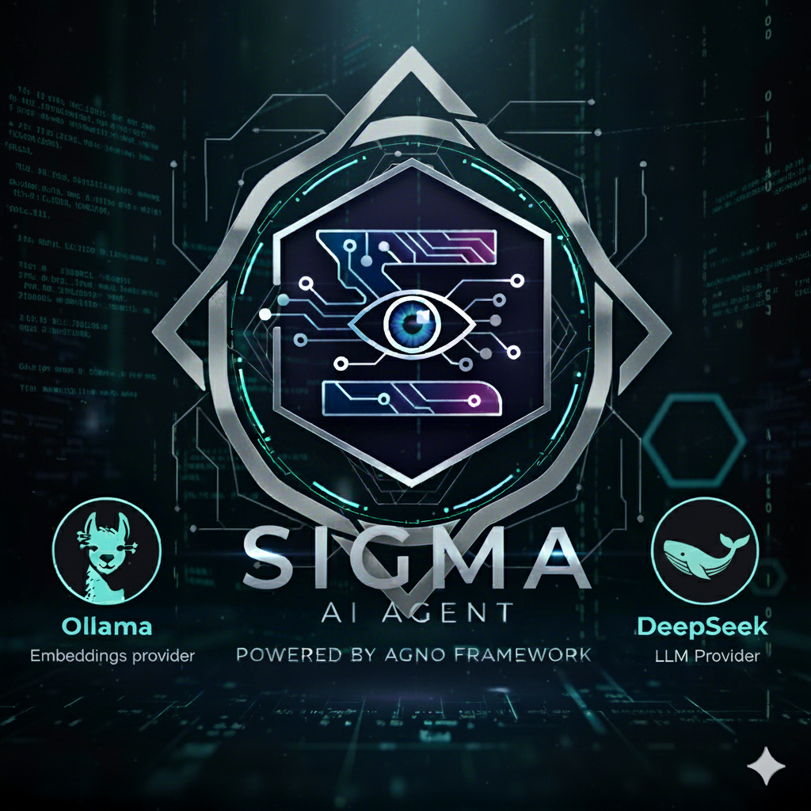

# 🌌 Sigma Agent — Majestic Agno Companion

<p align="center">
  
</p>

Sigma Agent is a handcrafted AI command-line assistant built with the [Agno](https://docs.agno.com) framework and powered by DeepSeek models. It blends long-term memory, vectorized knowledge retrieval, and a curated toolkit so you can research, reason, and execute tasks without leaving the terminal.

---

## ✨ Why Sigma Agent Stands Out
- **Agno Core** – battle-tested agent chassis with memory, tools, and prompt orchestration.
- **Knowledge-First Replies** – LanceDB stores embeddings, and Agno ensures evidence is retrieved before answers.
- **Safety Guardrails** – shell & file tools request confirmation, debug mode gates stack traces.
- **CLI UX Polish** – keyboard interrupts, session prompts, and goodbye flow are all handled gracefully.

---

## 🧠 Architecture at a Glance

```mermaid
graph TD
    subgraph Terminal & Services
        CLI[CLI v2 · prompt_toolkit<br/>sigma_cli.py]
        Basic[Minimal REPL<br/>agent_Sigma.py]
        AgentOSBridge[AgentOS bridge<br/>sigma_os.py]
    end

    subgraph Agent Core
        Agent[Agno Agent runtime]
        Reasoning[Optional reasoning model<br/>deepseek-reasoner / alt]
        Tools{{Agno Tool Suite}}
    end

    subgraph Data & Memory
        LanceDB[(LanceDB vector store)]
        SQLite[(SQLite memory DB)]
        TmpHist[(Session history<br/>SIGMA_TMP_DIR)]
    end

    CLI -->|prompt_async| Agent
    Basic -->|stdin loop| Agent
    AgentOSBridge -->|REST/Web UI| Agent

    Agent -->|primary inference| DeepSeek[DeepSeek primary model]
    Agent --> Reasoning
    Agent --> LanceDB
    Agent --> SQLite
    Agent --> Tools

    Tools -->|search| DuckDuckGo[DuckDuckGo]
    Tools -->|calc| Calculator[Calculator]
    Tools -->|memory| MemoryTools[Memory tools]
    Tools -->|files / shell| FileShell[File & Shell tools]
    Tools -->|push| Telegram[Telegram notifications]

    LanceDB -->|bootstrap| KnowledgeURL[Knowledge URL<br/>AGNO_KNOWLEDGE_URL]
    CLI -->|sessions + history| TmpHist
```


---

## 🚀 Quick Start
1. **Clone & enter the project**
   ```bash
   git clone https://github.com/Kaiors1/Sigma.git
   cd Sigma
   ```
2. **Create & activate the virtual environment**
   ```bash
   uv venv
   source .venv/bin/activate
   ```
   If you prefer the standard `venv` tooling:
   ```bash
   python3 -m venv .venv
   source .venv/bin/activate
   ```
3. **Install dependencies**
   ```bash
   uv pip install -r requirements.txt
   ```
   Or, with `pip`:
   ```bash
   pip install -r requirements.txt
   ```
4. **Set environment variables**
   - Copy `.env.example` (or edit `.env`) and adjust values—see [Configuration](#-configuration).
     ```bash
     cp .env.example .env
     ```
5. **Seed knowledge (optional)**
   - Place custom docs in a reachable URL and update `AGNO_KNOWLEDGE_URL`.
6. **Run the agent**
   ```bash
   python sigma_cli.py
   ```
   The enhanced CLI delivers async prompts, session manager, and live metrics. Prefer the minimal REPL?
   ```bash
   python agent_Sigma.py
   ```
   Type `exit`, `quit`, or `bye` to close the REPL.

---

## 🖥️ Interfaces
- `sigma_cli.py` – prompt-toolkit UI with async `prompt_async`, live metrics, smart file helpers, and session switcher (`/sessions`).
- `agent_Sigma.py` – minimal standard-input REPL; it reuses the same agent core without rich UI layers.
- `sigma_os.py` – AgentOS bridge that exposes Sigma over HTTP/Web UI for remote clients.
- Session prompt control – export `AGNO_PROMPT_SESSION_ID=true` to request a session ID at launch; unset it to auto-bootstrap with `AGNO_SESSION_ID` or a generated id.
- History and session metadata live in `SIGMA_TMP_DIR` (`tmp/` by default) as `.sigma_history` and `.sigma_sessions.json`.

---

## 🌐 AgentOS Personal Mode
Sigma now ships with an AgentOS wrapper so you can keep the familiar Sigma persona while unlocking the AgentOS control plane, API, and UI integrations.

### ROI Snapshot for Solo vs. Small Team Use
- **Centralized memory & knowledge** – AgentOS persists LanceDB + SQLite so you can resume conversations from any client without juggling REPL history.
- **Ready-made REST & UI** – the `/v1/agents` API and open-source Agent UI give you remote access from laptop or phone.
- **Easy future scaling** – when collaborators join, add more agents/teams to the same AgentOS instance without rewriting Sigma.

### Run the AgentOS locally
1. Configure any overrides in `.env` (see `AGNO_AGENT_*` and `AGNO_OS_*` keys for IDs, host, port, reload).
2. Start the service:
   ```bash
   python sigma_os.py
   ```
   The AgentOS API listens on `http://0.0.0.0:7777` by default; adjust with `AGNO_OS_HOST`/`AGNO_OS_PORT`.
3. (Recommended) Protect the instance by exporting `OS_SECURITY_KEY=<your-token>` before launching.

### Access Sigma from your phone with ngrok
1. In another terminal run `ngrok http 7777`.
2. Point your mobile browser or the Agent UI to the forwarded HTTPS URL.
3. If you set `OS_SECURITY_KEY`, include `Authorization: Bearer <token>` in API calls or the Agent UI login prompt.

Rollout idea: start with the local ngrok tunnel, then containerize and deploy on a private VM once you want persistent uptime.

---

## ⚙️ Configuration
All runtime knobs live in `.env`. Key options:

| Variable | Description | Default |
| --- | --- | --- |
| `AGNO_MODEL_ID` | Primary DeepSeek model id | `deepseek-reasoner` |
| `AGNO_DESCRIPTION` | Persona summary surfaced to Agno | Friendly professional agent |
| `AGNO_INSTRUCTIONS` | `||`-delimited operational rules | See `.env` |
| `AGNO_SESSION_ID` | Default session identifier when no prompt is shown | `sigma_chat_main` |
| `AGNO_PROMPT_SESSION_ID` | Set to `true` to request a session ID interactively | `false` |
| `AGNO_USER_ID` | Default user identity for personal memories | unset |
| `AGNO_SYSTEM_USER_ID` | Memory bucket for agent/system knowledge | `agent_system` |
| `AGNO_SEED_SYSTEM_MEMORIES` | Auto-seed baseline agent knowledge at startup | `true` |
| `AGNO_KNOWLEDGE_URL` | Bootstrap documentation URL | Agno docs mirror |
| `AGNO_ENABLE_REASONING` | Turn on Agno's step-by-step reasoning loop | `false` |
| `AGNO_REASONING_MIN_STEPS` / `AGNO_REASONING_MAX_STEPS` | Clamp reasoning iterations | `1` / `10` |
| `AGNO_REASONING_MODEL_ID` | Optional dedicated reasoning model (e.g. `deepseek-reasoner`) | unset |
| `AGNO_STREAM_INTERMEDIATE_STEPS` | Stream reasoning/tool events to the console | `false` |
| `AGNO_ENABLE_SHELL_TOOL` | Toggle shell access | `true` |
| `AGNO_SHELL_BASE_DIR` | Restrict shell commands to a directory | unset |
| `AGNO_FILE_BASE_DIR` | Restrict file tool scope | unset |
| `AGNO_ENABLE_DEBUG_MODE` | Bubble stack traces during development | `false` |
| `AGNO_ENABLE_SESSION_SUMMARIES` | Persist/run automatic session recaps for AgentOS UI | `true` |
| `SIGMA_TMP_DIR` | Workspace directory for CLI history and session metadata | `tmp` |
| `SIGMA_DEEPSEEK_INPUT_PRICE` | USD per-million-token input rate for cost estimates | `0.28` |
| `SIGMA_DEEPSEEK_OUTPUT_PRICE` | USD per-million-token output rate for cost estimates | `0.42` |
| `AGNO_CAPTURE_RESPONSES` | Save final answers to memory via the post-hook | `false` |
| `AGNO_CAPTURE_TOPIC` | Topic label used when `AGNO_CAPTURE_RESPONSES` is enabled | `sigma_responses` |
| `AGNO_UPDATE_KNOWLEDGE` | Append conversation summaries to LanceDB knowledge | `false` |

> Tip: Reset `AGNO_SESSION_ID` to blank to auto-generate unique sessions per run, and point `SIGMA_TMP_DIR` to a dedicated folder if you want history outside the repo.

---

## 🧰 Tool Suite
- **DuckDuckGoTools** – realtime web lookups.
- **CalculatorTools** – quick math and unit conversions.
- **MemoryTools** – persists conversational memory in SQLite.
- **FileTools** – controlled read/list/search/save on a whitelisted path.
- **ShellTools** – restrained shell execution with confirmation prompts.
- **TelegramTools** – push agent responses to Telegram chats (set AGNO_TELEGRAM_CHAT_ID / AGNO_TELEGRAM_TOKEN).

Each tool is toggled via `.env` booleans and inherits Agno’s guardrail instructions for safe use.

---

## 📚 Knowledge Workflow
- LanceDB vector store (backed by SQLite) anchors embeddings from `qwen3-embedding:8b`.
- `initialize_agent()` asynchronously seeds the store with the configured doc URL on first run.
- When `AGNO_UPDATE_KNOWLEDGE=true`, Sigma can push curated summaries back into LanceDB using the same API Agno exposes.
- Set `AGNO_SEARCH_KNOWLEDGE=false` to skip retrieval when speed matters more than citations.

### Reasoning & Memory Enhancements
- Fine-tune Agno’s built-in chain-of-thought via `AGNO_REASONING_MIN_STEPS` / `MAX_STEPS`, and supply a dedicated reasoning model when you want DeepSeek to handle the inner monologue.
- Enable `AGNO_STREAM_INTERMEDIATE_STEPS=true` to watch reasoning steps and tool calls stream live in the terminal.
- Flip on `AGNO_CAPTURE_RESPONSES=true` to persist validated answers automatically into the configured `MemoryManager` with a topic label of your choice.

---

## 🧪 Recommended Checks
- Smoke test: `python agent_Sigma.py` and verify the REPL handles Ctrl+C gracefully.
- Knowledge sync: confirm the first run downloads docs once, subsequent runs reuse cache.
- Tool toggles: temporarily set `AGNO_ENABLE_FILE_TOOL=false` to ensure the agent respects the flag.
- Enhanced CLI: run `AGNO_PROMPT_SESSION_ID=true python sigma_cli.py` and confirm the async session prompt, metrics panel, and DeepSeek cost estimates (override `SIGMA_DEEPSEEK_*` if pricing changes).

---

## 🤝 Contributing
1. Fork & branch: `git checkout -b feature/amazing-idea`
2. Run the smoke checks above.
3. Submit a PR with a crisp summary and screenshots of notable changes.

---

## 📄 License
Released under the [MIT License](LICENSE).

---
# Sigma_DeepSeek_Agno_Agent
